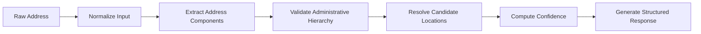

# Documentation

Address Quality is an API for validating and resolving Indonesian addresses.

Instead of simply parsing text, the API validates administrative hierarchy against official location data, resolves ambiguous matches, and returns structured results with confidence scores and explainable evidence.

Whether you're building a logistics platform, KYC workflow, customer onboarding, or data cleaning pipeline, Address Quality helps transform inconsistent address text into reliable structured data.

> [!WARNING]
> **Alpha Release**
>
> Address Quality is currently in **Alpha** and is intended for evaluation and testing. The API is not yet recommended for production workloads.

---

# How It Works

Every request follows the same validation pipeline.



## Validation Pipeline

| Step | Description |
|------|-------------|
| **Normalize Input** | Cleans and standardizes the input by handling casing, whitespace, abbreviations, and common variations. |
| **Extract Address Components** | Identifies administrative components such as province, city, district, subdistrict, and postal code. |
| **Validate Administrative Hierarchy** | Verifies that the extracted components form a valid administrative hierarchy using the selected location dataset. |
| **Resolve Candidate Locations** | When multiple valid matches exist, ranks candidates and selects the most likely location. |
| **Compute Confidence** | Calculates a confidence score based on the available validation evidence. |
| **Generate Structured Response** | Returns the resolved address, confidence score, assessment, candidate information, and metadata. |

---

# Quick Start

Get started in less than a minute.

## 1. Get an API Key

> [!WARNING]
> Self-service account registration is not available yet.
>
> API keys are currently issued manually during the Alpha program.

Include the API key in every request using the `X-API-Key` header.

## 2. Validate an Address

```bash
curl -X POST https://api.samaita.com/address-quality/v1/validate \
  -H "Content-Type: application/json" \
  -H "X-API-Key: your-api-key" \
  -d '{
    "address":"JL MERDEKA NO 56 CITARUM BANDUNG 40115"
  }'
```

---

# Authentication

All API requests require authentication.

| Header | Required |
|---------|----------|
| `X-API-Key` | Yes |

Requests without a valid API key return **401 Unauthorized**.

---

# API Reference

## POST `/v1/validate`

Validates an Indonesian address and returns the most likely administrative hierarchy.

### Request

```http
POST /v1/validate
Content-Type: application/json
```

```json
{
  "address": "JL MERDEKA NO 56 CITARUM BANDUNG 40115"
}
```

### Request Fields

| Field | Type | Required | Description |
|---------|------|----------|-------------|
| `address` | `string` | Yes | Raw Indonesian address. |
| `source_code` | `string` | No | Location dataset used for validation. Default: `kemendagri`. |

### Example

```json
{
  "address": "JL MERDEKA NO 56 CITARUM BANDUNG 40115",
  "source_code": "kemendagri"
}
```

---

# Successful Response

```json
{
  "timestamp": "2026-07-29T05:08:05Z",
  "request_id": "019fac45-d6cb-7101-9159-76bd7c25867b",
  "data": {
    "address_id": "019fac45-d6cb-7153-aeef-742c66db6d18",
    "status": "VALID",
    "confidence": 0.97,
    "raw_input": "JL MERDEKA NO 56 CITARUM BANDUNG 40115",
    "normalized_input": "jl merdeka no citarum bandung 40115",
    "formatted_address": "Citarum, Bandung Wetan, Kota Bandung, Jawa Barat 40115",
    "location": {
      "province": "Jawa Barat",
      "city": "Kota Bandung",
      "district": "Bandung Wetan",
      "sub_district": "Citarum",
      "postal_code": "40115"
    },
    "assessment": {
      "matched": [
        "province",
        "city",
        "district",
        "sub_district",
        "postal_code"
      ],
      "missing": [
        "road_name"
      ],
      "conflicts": [],
      "ambiguous": []
    },
    "resolution": {
      "strategy": [
        "top_down",
        "postal"
      ],
      "candidate_count": 1,
      "candidates": [
        {
          "score": 0.97,
          "reasons": [
            "exact_match",
            "match_postal_code_exact"
          ]
        }
      ]
    },
    "metadata": {
      "location_source": "kemendagri",
      "location_version": "2025"
    }
  }
}
```

---

# Understanding the Response

## Status

| Status | Description |
|---------|-------------|
| `VALID` | A single confident match was found. |
| `INCOMPLETE` | Some address components are missing. |
| `AMBIGUOUS` | Multiple valid candidates were found. |
| `CONFLICT` | The supplied components contradict each other. |
| `UNKNOWN` | No valid administrative hierarchy could be resolved. |

---

## Confidence

The confidence score ranges from **0.0** to **1.0**.

Higher scores indicate stronger evidence that the resolved location matches the supplied address.

The score is derived from multiple validation signals, including:

- Administrative hierarchy consistency
- Postal code validation
- Candidate comparison
- Validation evidence

The scoring algorithm may evolve over time without changing the API response format.

---

## Assessment

The `assessment` object explains how the supplied address compares to the resolved location.

| Field | Description |
|---------|-------------|
| `matched` | Components successfully validated. |
| `missing` | Components that were not found. |
| `conflicts` | Components that contradict the resolved hierarchy. |
| `ambiguous` | Components with multiple possible matches. |

---

## Resolution

The `resolution` object explains how the final location was selected.

| Field | Description |
|---------|-------------|
| `strategy` | Validation strategies used during resolution. |
| `candidate_count` | Number of valid candidate locations found. |
| `candidates` | Ranked candidate locations with confidence scores and supporting evidence. |

---

# Error Responses

| Status | Description |
|---------|-------------|
| `400` | Invalid request body. |
| `401` | Missing or invalid API key. |
| `429` | Rate limit exceeded. |
| `500` | Internal server error. |

Example:

```json
{
  "timestamp": "2026-07-29T05:06:43Z",
  "request_id": "019fac44-95c0-79cb-b1d4-649463403ea7",
  "error": "missing or invalid API key"
}
```

---

# Rate Limits

Rate limits are enforced per API key and IP address.

| Plan | Requests / Hour |
|------|-----------------|
| Free | 10 |
| Pro | TBA |

---

# Data Source

Address Quality validates addresses using official Indonesian administrative datasets.

| Dataset | Coverage |
|---------|----------|
| Kepmendagri No. 300.2.2-2430 Tahun 2025 | Province, City/Regency, District, Subdistrict, Postal Code |

Reference dataset:

- https://github.com/cahyadsn/wilayah_ref

Datasets are updated periodically as new administrative data becomes available.

---

# FAQ

### What address formats are supported?

Most Indonesian address formats are supported, including multiline addresses, abbreviations, postal codes, and mixed administrative components.

---

### Does the API return multiple candidates?

Yes.

When an address cannot be resolved uniquely, the response contains ranked candidate locations together with confidence scores and supporting evidence.

---

### How is confidence calculated?

Confidence is derived from multiple validation signals rather than a simple component count. The scoring model may evolve as additional validation evidence is introduced.

---

### Is the API deterministic?

Yes.

Given the same input and dataset version, the API returns consistent results.

---

### Can I use the API in production?

Not yet.

The current Alpha release is intended for evaluation and integration testing. While the API already supports authentication, rate limiting, automated testing, and periodic evaluation, it is **not yet recommended for production workloads**.